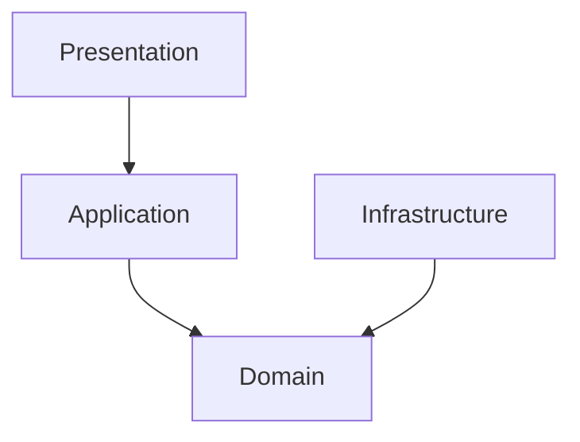

# Personal Finance Hub (PFH) 文档格式与排版规范

为了保证 PFH 项目所有设计文档的专业性、一致性和可读性，特制定本规范。所有新撰写的文档以及对现有文档的修改，必须严格遵守本规范。

---

## 1. 基础排版规范

### 1.1 中英文混排空格（盘古之白）

- **规则**：中文与英文、数字、半角符号之间必须添加一个空格。
- **示例**：
  - _不规范_：`C++23的强类型ID在Drogon框架中被广泛使用。`
  - _规范_：`C++23 的强类型 ID 在 Drogon 框架中被广泛使用。`
- **例外**：中文标点符号（如 `，`、`。`、`、`、`；`、`：`、`！`、`？`、`（`、`）`）与英文、数字之间**不加**空格。

### 1.2 标点符号规范

- **规则**：中文叙述中必须使用中文全角标点符号（如 `，`、`。`、`、`、`；`、`：`）。
- **规则**：英文、代码、JSON、SQL、数学公式中必须使用英文半角标点符号。
- **示例**：
  - _不规范_：`在 Domain 层,我们定义了 IAccountRepository; 它的实现位于 Infrastructure 层.`
  - _规范_：`在 Domain 层，我们定义了 IAccountRepository；它的实现位于 Infrastructure 层。`

### 1.3 专业术语拼写与大小写

- 必须严格统一以下核心术语的拼写和大小写：
  - **C++23**（不写为 c++23, C++ 23）
  - **PostgreSQL**（不写为 postgresql, Postgres, postgres）
  - **Drogon**（不写为 drogon）
  - **Clean Architecture**（不写为 clean architecture）
  - **Domain Service** / **Application Use Case** / **Infrastructure**
  - **std::expected**（不写为 std::Expected）
  - **Unit of Work** / **IUnitOfWork**
  - **JSON** / **DTO** / **API** / **JWT** / **CQRS**

---

## 2. Markdown 结构规范

### 2.1 标题级联与编号

- **规则**：文档标题必须使用一级标题（`#`），且每个文档只能有一个一级标题。
- **规则**：二级标题（`##`）用于大模块，必须带有阿拉伯数字编号（如 `## 1. 导言`）。
- **规则**：三级标题（`###`）用于子模块，必须带有级联编号（如 `### 1.1 核心原则`）。
- **规则**：四级标题（`####`）用于更细分的细节，可不带编号。
- **注意**：严禁跨级使用标题（例如在 `##` 下直接使用 `####`，或者将 `## 3.1` 作为二级标题）。

### 2.2 代码块规范

- **规则**：所有代码块必须显式指定语言标记（如 `cpp`, `sql`, `json`, `bash`, `text`, `mermaid`）。
- **规则**：C++ 代码必须符合 C++23 风格，类名使用 `PascalCase`，方法名使用 `camelCase`，成员变量使用 `under_score_` 或 `m_` 风格（本项目统一使用 `under_score_` 并在末尾加下划线，如 `amount_`）。

---

## 3. 目录与文件命名规范

### 3.1 核心设计文档命名

- **规则**：核心设计文档存放在 `Docs/Architecture/` 目录下，使用两位数字编号加下划线和英文大写单词（PascalCase 风格，单词间用下划线连接）命名。
- **示例**：`01_Technical_Architecture.md`、`09_Reporting_and_Analytics_Design.md`。

### 3.2 优化与修改记录文档命名

- **规则**：已完成的优化与修改记录文档存放在 `Docs/Archive/` 目录下。
- **命名格式**：
  - 正在更改/设计中的文档：必须以 `_Plan` 作为文件名后缀（如 `Documents_Optimize_Plan.md`），并且存放在 `Docs/Development/` 目录下。
  - 更改/设计完成并经评审通过的文档：**必须删掉 `_Plan` 后缀**，并归档入 `Docs/Archive/` 目录。
  - 历史已归档的修改记录：使用数字递增命名（如 `Documents_Optimize_1.md`）。

### 3.3 开发阶段交付记录文档命名

- **规则**：开发阶段的阶段性交付、验收与复盘记录在开发过程中存放在 `Docs/Development/` 目录下；对应交付内容验收完成并不再继续维护后，归档入 `Docs/Archive/` 目录。
- **命名格式**：
  - 单个开发步骤交付记录：`Phase_<阶段编号>_S<步骤编号>_Delivery_Summary.md`。
  - 连续多个开发步骤交付记录：`Phase_<阶段编号>_S<起始步骤编号>-S<结束步骤编号>_Delivery_Summary.md`。
  - 示例：`Phase_1_S04_Delivery_Summary.md`、`Phase_1_S01-S03_Delivery_Summary.md`。
- **归档规则**：
  - 开发中、待评审或仍需补充的交付记录：保留在 `Docs/Development/` 目录下。
  - 已验收并完成归档的交付记录：移动到 `Docs/Archive/` 目录下，文件名保持不变，以保留 Phase 与步骤范围的可追溯性。
  - 单个开发步骤不得写成 `S04-S04` 这类重复范围；只有连续多个步骤才使用 `S<起始>-S<结束>`。
  - 同一 Phase 和步骤范围不得重复创建多个交付记录；确需补充时，应优先修改原文件。

### 3.4 开发计划、指南与归档目录命名

- **开发计划目录**：总体和阶段性开发计划统一存放在 `Docs/Development_Plans/` 下。
- **指南目录**：实时目录结构说明、依赖安装、命令速查等操作型文档统一存放在 `Docs/Guides/` 下。
- **规范目录**：稳定的格式、命名和架构描述约束统一存放在 `Docs/Standards/` 下。
- **归档目录**：已完成的文档优化记录、交付记录和其他不再持续维护的阶段性记录统一存放在 `Docs/Archive/` 下。
- **命名格式**：上述目录中的英文文档名使用 PascalCase 风格，单词间使用下划线连接，例如 `Directory_Guidance.md`、`Dependency_Installation_Guide.md`、`Overall_Development_Plan.md`。

### 3.5 实际目录与规划目录

- **规则**：目录结构文档必须区分“当前仓库已提交内容”和“规划中、按需创建内容”。
- **规则**：README 中的目录树只列出当前已提交的文件和目录；规划中的目录或文件必须用正文说明，不得写入当前目录树。
- **规则**：历史归档文档中的相对链接必须从归档文件所在目录出发，指向真实存在的文档路径。

### 3.6 Phase 分支交付规则

- **规则**：每个 Phase 必须在独立的长期开发分支上推进，不直接在 `main` 上进行阶段性功能开发。
- **推荐命名**：`phase/phase-1`、`phase/phase-2`、`phase/phase-3`。
- **规则**：对应 Phase 的代码实现、文档回写、交付总结和测试验证应优先在该 Phase 分支内完成。
- **规则**：只有当该 Phase 对应范围已经完成完整测试、交付文档已回写且确认可交付后，才允许将该 Phase 分支合并回 `main`。
- **规则**：未完成回归验证的半成品提交，不得直接合并到 `main`。

---

## 4. 统一文档模板

所有设计文档应尽量符合以下结构模板：

````markdown
# Personal Finance Hub - [模块英文名称] Design

Version: 1.0
Backend: C++23
Architecture: Clean Architecture + Lightweight DDD
Status: [Draft / Approved / Superseded]

---

## 1. 导言与设计目标

[简要描述该模块的设计背景、解决的业务痛点以及核心设计目标。]

### 1.1 核心原则

- **原则一**：描述。
- **原则二**：描述。

---

## 2. 架构定位与职责边界

[使用 Mermaid 流程图或文本架构图展示该模块在 Clean Architecture 四层中的位置及依赖关系。]



---

## 3. 核心设计细节

### 3.1 [设计细节一]

详细描述。

#### 3.1.1 [子细节一]

详细描述。

---

## 4. 接口与数据契约

### 4.1 接口定义 (C++23)

```cpp
// 纯净的 C++23 接口，不含第三方框架依赖
```

### 4.2 数据传输对象 (DTO) / JSON 契约

```json
{
  "field_name": "string_value"
}
```

---

## 5. 错误处理与测试规约

### 5.1 错误码映射

[列出该模块特有的错误码及对应的 HTTP 状态码。]

### 5.2 核心测试用例

- **用例一**：输入 -> 期望输出。
````

---

## 5. 架构描述统一规则

### 5.1 事务与事件

- **规则**：`IUnitOfWork` 文档必须明确业务写入、outbox 写入和事务提交使用同一个数据库事务上下文；不得出现创建事务对象但 Repository 仍使用普通 `DbClient` 写库的示例。
- **规则**：领域事件不得在业务事务提交前直接派发。当前标准实现为 Transactional Outbox：事务内只写 `domain_events_outbox`，提交后由 `OutboxPublisherJob` 投递。

### 5.2 汇率与金额

- **规则**：当前汇率存储统一为 USD 枢纽方向，即数据库保存 `USD -> target` 汇率；交叉汇率 `base -> target` 通过 `pivotToTarget / pivotToBase` 推导。
- **规则**：金额、汇率和 JSON 中的十进制数不得经由 `float`、`double` 或 JSON number 转换；必须使用十进制字符串进入 `Decimal`。
- **规则**：数据库缺少汇率时必须返回明确错误或展示“不可用”，不得用 `0`、`1` 或其他默认值参与财务计算。
- **规则**：默认舍入策略为银行家舍入（Half-Even）。其他舍入策略只有在业务场景显式记录时才可使用。

### 5.3 调度与后台任务

- **规则**：Drogon Event Loop 只负责触发定时器和分发轻量回调；包含网络 I/O、数据库 I/O 或 CPU 密集计算的后台任务必须进入工作线程、协程异步链路或专用执行器，避免阻塞 HTTP 请求处理线程。
- **规则**：当前阶段不引入 Redis、RabbitMQ、Kafka 等强依赖；分布式锁、任务幂等和可恢复状态优先使用 PostgreSQL 实现。Redis 仅作为未来可选加速层。

### 5.4 多租户与幂等键

- **规则**：所有跨用户数据表和唯一约束必须显式包含 `user_id` 或通过关联表强约束用户边界。
- **规则**：外部同步幂等键不得只使用 `(provider, external_transaction_id)`；必须至少包含 `user_id`，必要时同时包含 `external_account_id` 或内部 `account_id`。

### 5.5 可选方案记录

- **规则**：当出现多个优良程度接近的架构选择时，不在正文中直接选边；应在本文件新增“待决策选项”小节，列出选项、影响和建议选择依据，等待维护者确认。

---

## 6. 待决策选项

当前没有必须由维护者二选一的架构项。后续如出现多个相近方案，在本节追加记录。
