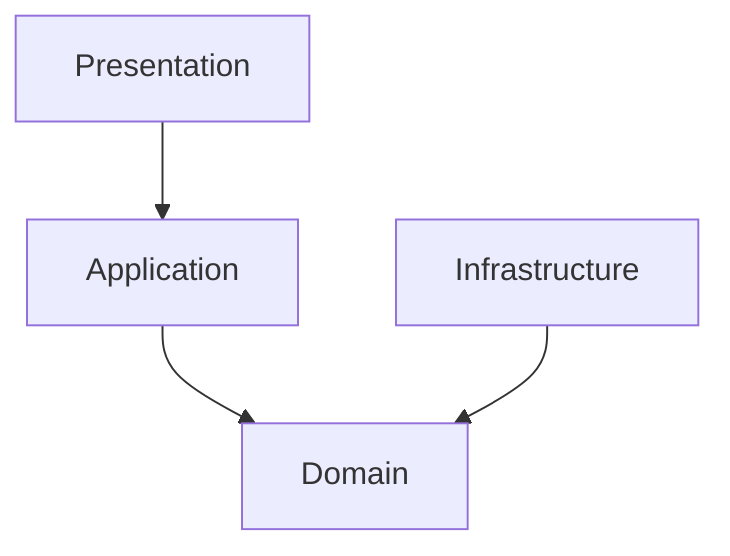

# Personal Finance Hub (PFH) 文档格式与排版规范

为了保证 PFH 项目所有设计文档的专业性、一致性和可读性，特制定本规范。所有新撰写的文档以及对现有文档的修改，必须严格遵守本规范。

---

## 1. 基础排版规范

### 1.1 中英文混排空格（盘古之白）

- **规则**：中文与英文、数字、半角符号之间必须添加一个空格。
- **示例**：
  - _不规范_：`C++23的强类型ID在Drogon框架中被广泛使用。`
  - _规范_：`C++23 的强类型 ID 在 Drogon 框架中被广泛使用。`
- **例外**：中文标点符号（如 `，`、`。`、`、`、`；`、`：`、`！`、`？`、`（`、`）`）与英文、数字之间**不加**空格。

### 1.2 标点符号规范

- **规则**：中文叙述中必须使用中文全角标点符号（如 `，`、`。`、`、`、`；`、`：`）。
- **规则**：英文、代码、JSON、SQL、数学公式中必须使用英文半角标点符号。
- **示例**：
  - _不规范_：`在 Domain 层,我们定义了 IAccountRepository; 它的实现位于 Infrastructure 层.`
  - _规范_：`在 Domain 层，我们定义了 IAccountRepository；它的实现位于 Infrastructure 层。`

### 1.3 专业术语拼写与大小写

- 必须严格统一以下核心术语的拼写和大小写：
  - **C++23**（不写为 c++23, C++ 23）
  - **PostgreSQL**（不写为 postgresql, Postgres, postgres）
  - **Drogon**（不写为 drogon）
  - **Clean Architecture**（不写为 clean architecture）
  - **Domain Service** / **Application Use Case** / **Infrastructure**
  - **std::expected**（不写为 std::Expected）
  - **Unit of Work** / **IUnitOfWork**
  - **JSON** / **DTO** / **API** / **JWT** / **CQRS**

---

## 2. Markdown 结构规范

### 2.1 标题级联与编号

- **规则**：文档标题必须使用一级标题（`#`），且每个文档只能有一个一级标题。
- **规则**：二级标题（`##`）用于大模块，必须带有阿拉伯数字编号（如 `## 1. 导言`）。
- **规则**：三级标题（`###`）用于子模块，必须带有级联编号（如 `### 1.1 核心原则`）。
- **规则**：四级标题（`####`）用于更细分的细节，可不带编号。
- **注意**：严禁跨级使用标题（例如在 `##` 下直接使用 `####`，或者将 `## 3.1` 作为二级标题）。

### 2.2 代码块规范

- **规则**：所有代码块必须显式指定语言标记（如 `cpp`, `sql`, `json`, `bash`, `text`, `mermaid`）。
- **规则**：C++ 代码必须符合 C++23 风格，类名使用 `PascalCase`，方法名使用 `camelCase`，成员变量使用 `under_score_` 或 `m_` 风格（本项目统一使用 `under_score_` 并在末尾加下划线，如 `amount_`）。

---

## 3. 目录与文件命名规范

### 3.1 核心设计文档命名
* **规则**：核心设计文档存放在 `Docs/Architecture/` 目录下，使用两位数字编号加下划线和英文大写单词（PascalCase 风格，单词间用下划线连接）命名。
* **示例**：`01_Technical_Architecture.md`、`09_Reporting_and_Analytics_Design.md`。

### 3.2 优化与修改记录文档命名
* **规则**：已完成的优化与修改记录文档存放在 `Docs/Completed_Modifications/` 目录下。
* **命名格式**：
  * 正在更改/设计中的文档：必须以 `_Plan` 作为文件名后缀（如 `Documents_Optimize_Plan.md`），并且存放在 `Docs/Development/` 目录下。
  * 更改/设计完成并经评审通过的文档：**必须删掉 `_Plan` 后缀**，并归档入 `Docs/Completed_Modifications/` 目录。
  * 历史已归档的修改记录：使用数字递增命名（如 `Documents_Optimize_1.md`）。

---

## 4. 统一文档模板

所有设计文档应尽量符合以下结构模板：

````markdown
# Personal Finance Hub - [模块英文名称] Design

Version: 1.0  
Backend: C++23  
Architecture: Clean Architecture + Lightweight DDD  
Status: [Draft / Approved / Superseded]

---

## 1. 导言与设计目标

[简要描述该模块的设计背景、解决的业务痛点以及核心设计目标。]

### 1.1 核心原则

- **原则一**：描述。
- **原则二**：描述。

---

## 2. 架构定位与职责边界

[使用 Mermaid 流程图或文本架构图展示该模块在 Clean Architecture 四层中的位置及依赖关系。]


````

---

## 3. 核心设计细节

### 3.1 [设计细节一]

详细描述。

#### 3.1.1 [子细节一]

详细描述。

---

## 4. 接口与数据契约

### 4.1 接口定义 (C++23)

```cpp
// 纯净的 C++23 接口，不含第三方框架依赖
```

### 4.2 数据传输对象 (DTO) / JSON 契约

```json
{
  "field_name": "string_value"
}
```

---

## 5. 错误处理与测试规约

### 5.1 错误码映射

[列出该模块特有的错误码及对应的 HTTP 状态码。]

### 5.2 核心测试用例

- **用例一**：输入 -> 期望输出。

```

```
